# Spring Service Refactoring

## Overview

Refactor Java/Spring backend code conservatively. Keep external behavior stable, make entry methods read like clean process orchestration, and move detail work into smaller units with clear responsibilities.

Before reading a large Java file in full, run `scripts/review_java_file.py <file> [--method name]` to generate a compact structural summary. Use that artifact first, then return to the source file only for the lines that actually need judgment.

Before reviewing a wide Java diff, run `scripts/review_git_diff.py --repo <repo>` to compress changed files into a smaller review artifact and focus follow-up reading on the risky hunks.

## Workflow Decision

```dot
digraph refactor_flow {
    rankdir=LR;
    start [label="Large or unclear method?", shape=diamond];
    apply [label="Use this skill", shape=box];
    contract [label="Need to change external input/output,\npublic signature, or exception contract?", shape=diamond];
    ask [label="Stop and declare the change first", shape=box];
    safe [label="Proceed with internal refactoring", shape=box];
    review [label="Run post-refactor review", shape=box];

    start -> apply [label="yes"];
    apply -> contract;
    contract -> ask [label="yes"];
    contract -> safe [label="no"];
    safe -> review;
}
```



## Core Rules

- Treat controller APIs, external DTOs, public service signatures, return structures, and observable exception semantics as stable by default.
- If a good refactor requires changing external input or output, stop and declare that explicitly before making the change.
- Keep entry methods focused on process orchestration, not low-level details.
- Enforce clear naming as a hard rule. Method, class, context, and variable names must express responsibility and business meaning directly.
- Enforce single responsibility as a hard rule. If a method or helper spans multiple workflow stages without a strong reason, keep refactoring.
- Add comments deliberately. The refactored code must contain comments that explain stage boundaries, non-obvious business intent, or why a sequence matters.
- Treat resource lifecycle as part of behavior. Lock release, thread-pool shutdown, stream or client close, and temporary context cleanup must remain explicit and verifiable after refactoring.
- Release a resource only when acquisition or initialization is known to have succeeded. Do not keep or introduce unconditional cleanup that can run on an unacquired lock, unopened resource, or uninitialized executor.
- Prefer small, local, reversible changes over broad rewrites.
- Refactor in this order: split process stages and boundaries, remove real duplication, optimize performance last.

## Entry Method Pattern

Shape each entry method into clean stages whenever the code allows:

1. Condition validation
2. Parameter construction
3. Business processing
4. Post-processing

Interpret the stages like this:

- `Condition validation`: argument checks, state checks, permission checks, idempotency checks, business preconditions.
- `Parameter construction`: build query conditions, domain objects, command objects, DTO conversions, downstream call arguments.
- `Business processing`: query, decide, write, update relations, call collaborators, enforce transaction semantics.
- `Post-processing`: assemble response, trigger async logging, send notifications, publish events, cleanup.

The entry method should read like a workflow. Heavy branching, data reshaping, persistence detail, and formatting logic should usually move into private methods or focused collaborators.

For stateful service methods that involve locks, Redis, database writes, or auto-triggered side effects, interpret the stages more strictly:

- `Condition validation`: caller identity, input count, task existence, feature switches, lock acquisition preconditions.
- `Parameter construction`: cache keys, context objects, filtered task lists, derived counters, transition inputs.
- `Business processing`: load current state, validate transition legality, update cache or DB state, execute the core state change.
- `Post-processing`: reward claiming, async notifications, cache invalidation, expiration refresh, response assembly, lock-safe cleanup.

Do not let one helper mix state loading, transition decision, persistence, and post-side-effect dispatch unless the sequence is trivial.

## Refactoring Order

### 1. Split the flow first

When one method mixes validation, object assembly, repository access, writes, and response building, extract stage methods before inventing abstractions.

Good direction:

```java
public Result submit(SubmitCommand command) {
    validateSubmit(command);
    SubmitContext context = buildSubmitContext(command);
    SubmitResult result = executeSubmit(context);
    return buildSubmitResponse(result);
}
```

### 2. Clarify responsibilities

Look for responsibilities that should not live in the same method or class:

- validation vs business decision
- object conversion vs domain processing
- repository orchestration vs response assembly
- synchronous core flow vs async side effects

If a responsibility has its own vocabulary and rules, give it a named method or a small collaborator.

Clear names are part of the design, not polish:

- prefer `validateTaskRequest`, `buildTaskContext`, `executeRewardClaim`, `afterTaskClaim`
- reject `handle`, `process`, `common`, `helper`, `util`
- reject local names like `data`, `obj`, `result`, `tmp` when a business name is available

### 3. Remove real duplication

Only extract shared helpers when duplication is stable across multiple call sites. Do not create common abstractions just because two code blocks look similar once.

### 4. Optimize last

Consider performance changes only after the flow is readable, or when the user explicitly asks for optimization. Prioritize obvious backend issues:

- repeated queries in one request path
- redundant DTO conversions
- repeated collection scans
- unnecessary remote calls

Do not change transaction timing or side-effect order just to make the code look cleaner.

## Practical Moves

- Run `scripts/review_java_file.py` first on large files to compress method structure, side effects, and obvious cleanup risks before deeper analysis.
- Run `scripts/review_git_diff.py` first on large Java diffs to identify contract drift, cleanup regressions, and high-risk changes before manual review.
- Extract `validateXxx`, `buildXxx`, `executeXxx`, `afterXxx`, `toXxxResponse` style methods when they reflect real stages.
- Rename ambiguous methods and variables as part of the refactor. Do not keep vague names just to minimize diff size.
- Add a short comment before each major stage in an entry method when the workflow is not obvious at a glance.
- Add comments for business rules, transaction-sensitive ordering, and side effects that would be easy to misunderstand from code alone.
- Introduce a transition context object for stateful workflows that pass lock state, cache state, counters, or filtered task sets through multiple steps.
- Introduce a small context object when many local variables are passed through the same workflow.
- Move reusable validation or assembly logic down into dedicated helpers or services only after it is proven to repeat.
- Separate "query then decide then write" into explicit steps so state transitions are easy to review.
- Isolate lock handling so acquisition, guarded execution, and safe release are easy to verify by inspection.
- Keep resource acquisition and release paired in a structure that is obvious on read, such as `try/finally`, `try-with-resources`, or a small dedicated wrapper with explicit cleanup.
- Guard cleanup with the real acquisition result when required. For example, only `unlock` after a successful `tryLock`, and only `shutdown` resources that were actually created.
- Isolate cache expiration and invalidation rules from the main state transition when they are policy, not core business logic.
- Pull async logging, notifications, and audit writes out of the core happy path when behavior stays equivalent.
- Preserve transaction boundaries unless the user approves a change.

## Comment Template

Use concise comments that explain stage intent, not line-by-line syntax.

```java
public Result submit(SubmitCommand command) {
    // 1. Validate request and business preconditions before any state change.
    validateSubmit(command);

    // 2. Build query and command context used by the main workflow.
    SubmitContext context = buildSubmitContext(command);

    // 3. Execute the core flow: query current state, decide, then persist updates.
    SubmitResult result = executeSubmit(context);

    // 4. Assemble the response and trigger post-processing side effects.
    return buildSubmitResponse(result);
}
```

Add extra comments when needed for:

- why a query must happen before a write
- why a side effect stays synchronous or can move async
- why a transaction boundary must stay where it is
- why a lock, cache invalidation, or expiration update must happen at a specific point
- why a resource must be released in `finally`, shutdown hook, or equivalent cleanup path
- why cleanup is conditional on successful acquisition or initialization
- why a duplicated block is intentionally not abstracted yet

## Stateful Workflow Pattern

Use a stricter orchestration style for service methods that mix lock control, cache state, persistence, and automatic reward or side-effect triggers.

```java
public void completeTask(TaskCommand command) {
    // 1. Validate request and confirm the method is allowed to proceed.
    validateTaskCommand(command);

    // 2. Build workflow context, including lock key and current user task state.
    TaskWorkflowContext context = buildTaskWorkflowContext(command);

    // 3. Execute the state transition under lock and persist the new state.
    executeTaskTransition(context);

    // 4. Trigger follow-up actions such as reward claiming or cache refresh.
    afterTaskTransition(context);
}
```

When using this pattern:

- Keep lock acquisition and release visible.
- Keep resource cleanup visible and paired with acquisition.
- Keep conditional cleanup visible when release depends on `acquired`, `initialized`, or similar flags.
- Keep state transition rules together.
- Keep post-actions separate from the transition itself.
- Keep cache TTL refresh and popup or tips logic out of the middle of transition code when possible.

## Resource Cleanup Pattern

When refactoring Java service methods, make cleanup correctness obvious in code shape.

Good:

```java
boolean acquired = false;
RLock lock = redissonClient.getLock(lockKey);
try {
    acquired = lock.tryLock(3, 10, TimeUnit.SECONDS);
    if (!acquired) {
        return;
    }

    executeLockedWorkflow();
} finally {
    if (acquired) {
        lock.unlock();
    }
}
```

Bad:

```java
RLock lock = redissonClient.getLock(lockKey);
try {
    boolean acquired = lock.tryLock(3, 10, TimeUnit.SECONDS);
    if (acquired) {
        executeLockedWorkflow();
    }
} finally {
    lock.unlock();
}
```

Use the same principle for thread pools, streams, temporary auth context, and client resources: cleanup must match actual acquisition or initialization.

## Post-Refactor Review

Do not stop after the code compiles. Review the changed entry method and the diff as a separate gate.

Review in this order:

1. Re-read the entry method top-down and confirm it now reads as workflow orchestration.
2. Check that each extracted method belongs to one stage: validation, parameter construction, business processing, or post-processing.
3. Confirm no extracted helper still mixes query, write, response assembly, and async side effects without a good reason.
4. Confirm method and variable names now make responsibility obvious without reading internals line by line.
5. Review the diff for contract drift: public signatures, DTO fields, return shape, exception behavior, transaction timing, and side-effect order.
6. Review lock handling, state transition ordering, cache invalidation, and expiration updates for hidden behavior drift.
7. Review resource cleanup paths: lock release, thread-pool shutdown, context restore, stream close, and client cleanup must still happen on success and failure paths.
8. Confirm cleanup is conditional where necessary: no unconditional `unlock`, `close`, or `shutdown` on resources that may not have been acquired.
9. Reject vague abstractions added only for reuse appearance, especially utility classes or helpers with weak names.

If the review finds a mixed-stage helper or hidden behavior change, refactor again before claiming the work is done.

## Stop Conditions

Stop and surface the issue before editing when any of these are true:

- external request or response contract must change
- public method signature must change
- exception semantics visible to callers must change
- transaction boundary or side-effect timing is unclear
- a proposed abstraction is shared by only one unstable use case

## Common Mistakes

- Hiding a messy method inside one new helper instead of splitting the workflow stages.
- Keeping a vague name after refactoring, such as `handle`, `process`, `data`, or `result`, when the code now has a clear responsibility.
- Extracting shared utilities too early and creating vague `CommonUtil` style code.
- Mixing response assembly back into business processing after the method was split.
- Leaving the refactored flow without comments, forcing readers to reverse-engineer stage intent from implementation details.
- Leaving lock release, cache invalidation, or TTL refresh buried in the middle of business logic so the true state transition is hard to verify.
- Splitting code in a way that hides or weakens cleanup guarantees, such as moving `unlock`, `shutdown`, or context restore out of an obvious finally path.
- Releasing a lock, thread pool, stream, or context unconditionally even though acquisition or initialization may have failed.
- Quietly changing return data, nullability, or thrown exceptions during "refactor only" work.
- Moving logging or event publishing without checking whether callers rely on timing.

## Verification

- Run the post-refactor review before finalizing the change.
- Read the entry method top-down and confirm each line represents one stage of the workflow.
- Check that validation, parameter construction, processing, and post-processing are visibly separated.
- Confirm comments exist for major stages and for any non-obvious rule, ordering dependency, or side effect.
- Confirm lock acquisition and release, cache mutation, persistence, and post-actions remain in a defensible order.
- Confirm resource release remains correct on all paths: success, early return, exception, and retry or timeout paths.
- Confirm conditional cleanup still matches reality: release only what was actually acquired or initialized.
- Confirm public signatures, DTO fields, return shape, and externally visible exceptions are unchanged.
- Run targeted tests for the touched path. Add tests first when behavior is not already protected.
- Use `references/checklist.md` when the refactor spans multiple methods or classes.
